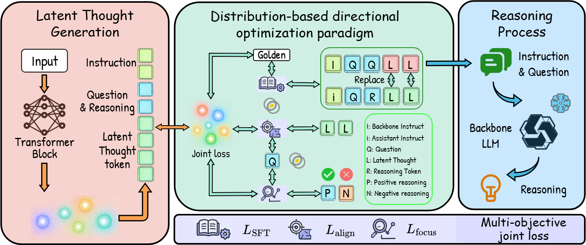

<div align="center"> <h1>LTA-thinker: Latent Thought-Augmented Training Framework for Large Language Models on Complex Reasoning</h1> </div>

<p align="center"> <a href="https://arxiv.org/abs/2509.12875"> </a> <br> <b>作者:</b> <b>
<a href="https://github.com/wangjiaqi886">Jiaqi Wang</a>,
<a href="https://github.com/neukg">NEU KG Group</a>
</b> <br>
<b>arxiv:</b> <b>
<a href="https://arxiv.org/abs/2509.12875">LTA-thinker</a>
</b>
</p>


## 概述


我们介绍了 **LTA-thinker**，一个为提升大型语言模型（LLM）在复杂推理任务上表现而设计的“潜思增强训练框架”。

Complex Reasoning in Large Language Models can be dynamically optimized using Test-Time Scaling (TTS) to mitigate Overthinking. Methods such as Coconut, SoftCoT and its variant are effective in continuous latent space inference, the core bottleneck still lies in the efficient generation and utilization of high-quality Latent Thought. Drawing from the theory of SoftCoT++ that a larger variance in the generated Latent Thought distribution more closely approximates the golden truth distribution, we propose a Latent Thought-Augmented Training Framework--LTA-Thinker, which improves distributional variance and enhances reasoning performance from two perspectives. First, LTA-Thinker constructs a Latent Thought generation architecture based on a learnable prior. This architecture aims to increase the variance distribution of generated Latent Thought Vectors in order to simplify the overall structure and raise the performance ceiling. Second, LTA-Thinker introduces a distribution-based directional optimization paradigm that jointly constrains both distribution locality and distribution scale. This mechanism improves information efficiency and computational cost through a multi-objective co-training strategy, which combines standard Supervised Fine-Tuning (SFT) loss with two novel losses: Semantic Alignment Loss, which utilizes KL divergence to ensure that the Latent Thought is highly relevant to the semantics of the question; Reasoning Focus Loss, which utilizes a contrastive learning mechanism to guide the model to focus on the most critical reasoning steps. Experiments show that LTA-thinker achieves state-of-the-art (SOTA) performance among various baselines and demonstrates a higher performance ceiling and better scaling effects.



## 快速开始

### 环境与依赖

首先，请确保您已安装以下核心依赖项：

- torch==2.7.1
- transformers==4.53.2


### 准备数据


以 `GSM8K` 数学推理任务为例，您需要将数据预处理成项目所需的格式。请参考 `./data/gsm8k` 文件夹中的数据样例。每个数据集的加载逻辑可以在 `data_loader.py` 文件中找到。


### 模型训练


我们使用 `torchrun` 在多GPU环境下进行训练。以下是一个在 `GSM8K` 数据集上训练 Qwen3 系列模型的示例。

您可以直接运行 `bash` 目录下的训练脚本：

Bash

```
bash run_train.sh
```

该脚本的核心命令如下：

Bash

```
CUDA_VISIBLE_DEVICES=4,5,6,7 torchrun \
    --nproc_per_node=4 \
    --master_port=29501 \
    train.py \
    --large_model_id Qwen/Qwen3-8B-Instruct \
    --small_model_id Qwen/Qwen3-0.6B-Instruct \
    --output_name [Your_Experiment_Name] \
    --gradient_accumulation_steps 4 \
    --batch_size 4 \
    --task_name gsm8k \
    --learning_rate 1e-4 \
    --num_thought_tokens 32 \
    --n_epochs 10.0
```

**关键参数说明:**

- `--large_model_id`: 主 LLM 的模型 ID (例如来自 Hugging Face Hub)。
- `--small_model_id`: 辅助 LLM 的模型 ID。
- `--output_name`: 用于区分不同实验设置的输出名称，模型权重和日志将保存在以此命名的文件夹下。
- `--task_name`: 指定训练任务，例如 `gsm8k`、`strategyqa` 或 `math`。
- `--num_thought_tokens`: 指定生成的潜在思想向量的数量。
- `--n_epochs`: 训练的总轮数。

训练完成后，最优的模型检查点（包含投影模块 `projection.bin` 和注意力模块 `TransformerBlock.bin`）将被保存在 `./ckpt/` 目录下。


### 模型测试


训练结束后，我们可以使用保存的模块权重进行性能评估。

您可以直接运行 `bash` 目录下的评估脚本：

Bash

```
bash run_evaluate.sh
```

该脚本的核心命令如下：

Bash

```
export CUDA_VISIBLE_DEVICES=2,3
python -u evaluate.py \
	--base_model_id Qwen/Qwen3-8B-Instruct \
	--assistant_model_id Qwen/Qwen3-0.6B-Instruct \
	--params_file_name [Path_To_Your_Checkpoint]/projection.bin \
	--att_file_name [Path_To_Your_Checkpoint]/TransformerBlock.bin \
	--batch_size 4 \
	--task_name gsm8k \
	--num_thought_tokens 2 \
	--num_return_sequences 10 \
	--print_response
```

**关键参数说明:**

- `--base_model_id`: 用于评估的主 LLM。
- `--assistant_model_id`: 用于评估的辅助 LLM。
- `--params_file_name`: 指向训练好的投影模块权重文件 (`projection.bin`) 的路径。
- `--att_file_name`: 指向训练好的注意力模块权重文件 (`TransformerBlock.bin`) 的路径。
- `--task_name`: 指定您希望评估的数据集。
- `--num_return_sequences`: 多次采样生成答案的数量，用于提升最终答案的准确性。
- `--print_response`: 在控制台打印模型的完整输出。


## 引用

特别感谢：

```
@article{xu2025softcot,
  title={{SoftCoT}: Soft chain-of-thought for efficient reasoning with llms},
  author={Xu, Yige and Guo, Xu and Zeng, Zhiwei and Miao, Chunyan},
  journal={arXiv preprint arXiv:2502.12134},
  year={2025}
}
```

如果您在研究中使用了 LTA-thinker，请引用我们的论文：

```
@article{lastname2025ltathinker,
  title={{LTA-thinker: Latent Thought-Augmented Training Framework for Large Language Models on Complex Reasoning}},
  author={[Author Names]},
  journal={arXiv preprint arXiv:2509.12875},
  year={2025}
}
```
